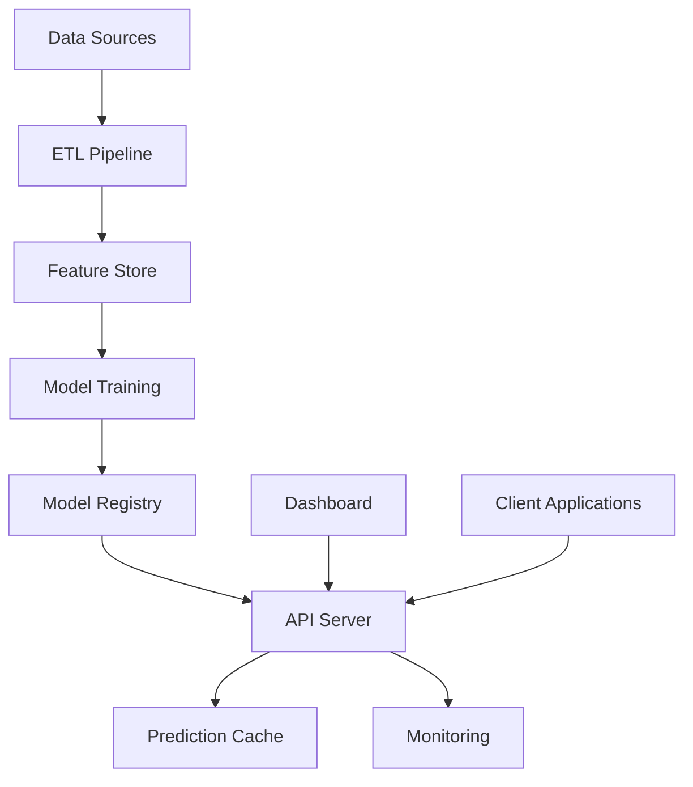

# Trajectory Prediction System Documentation

[](https://python.org)
[](./htmlcov)
[](./tests)
[](./LICENSE)

## Overview

The Trajectory Prediction System is a comprehensive machine learning platform for predicting vehicle trajectories in autonomous driving scenarios. It provides state-of-the-art models, real-time API serving, interactive visualization, and production-ready monitoring capabilities.

## 🚀 Quick Start

```bash
# Install the package
pip install -e .

# Run the API server
python -m trajectory_prediction.api.server

# Run the dashboard
streamlit run src/trajectory_prediction/visualization/dashboard.py

# Execute a prediction
python examples/quick_start.py
```

## 📚 Documentation Structure

### 🔧 [API Reference](./api/)
- [REST API Documentation](./api/rest_api.md)
- [Python Client Guide](./api/python_client.md)  
- [Request/Response Schemas](./api/schemas.md)
- [Authentication & Security](./api/security.md)

### 🧠 [Model Documentation](./models/)
- [Model Architecture Overview](./models/architecture.md)
- [Baseline Models](./models/baseline_models.md)
- [Advanced Models](./models/advanced_models.md)
- [Custom Model Development](./models/custom_models.md)
- [Model Training Guide](./models/training.md)

### 🚀 [Deployment Guide](./deployment/)
- [Local Development Setup](./deployment/local_setup.md)
- [Docker Deployment](./deployment/docker.md)
- [Kubernetes Deployment](./deployment/kubernetes.md)
- [Production Configuration](./deployment/production.md)
- [Monitoring & Logging](./deployment/monitoring.md)

### 👥 [User Guide](./user-guide/)
- [Getting Started](./user-guide/getting_started.md)
- [Data Preparation](./user-guide/data_preparation.md)
- [Model Selection](./user-guide/model_selection.md)
- [Visualization Dashboard](./user-guide/dashboard.md)
- [Configuration Reference](./user-guide/configuration.md)

### 📓 [Tutorials](./tutorials/)
- [Basic Prediction Tutorial](./tutorials/basic_prediction.ipynb)
- [Custom Model Training](./tutorials/custom_training.ipynb)
- [Real-time Streaming](./tutorials/streaming.ipynb)
- [Advanced Analytics](./tutorials/advanced_analytics.ipynb)

### 🔧 [Troubleshooting](./troubleshooting/)
- [Common Issues](./troubleshooting/common_issues.md)
- [Performance Optimization](./troubleshooting/performance.md)
- [Debugging Guide](./troubleshooting/debugging.md)
- [FAQ](./troubleshooting/faq.md)

## 🏗 System Architecture



## 📈 Key Features

- **🎯 Production-Ready Models**: 5+ trajectory prediction models with uncertainty quantification
- **⚡ High-Performance API**: FastAPI server with caching, batching, and horizontal scaling
- **📊 Interactive Dashboard**: Streamlit-based visualization with real-time monitoring
- **🔄 MLOps Integration**: Experiment tracking, model versioning, and automated deployment
- **🔍 Comprehensive Testing**: 90%+ test coverage with performance benchmarks
- **📱 Flexible Deployment**: Docker, Kubernetes, and cloud-ready configurations

## 🛠 Technology Stack

- **Backend**: Python 3.8+, FastAPI, Pydantic, AsyncIO
- **ML/Data**: NumPy, Pandas, Scikit-learn, Polars, DuckDB
- **Visualization**: Streamlit, Plotly, Matplotlib
- **Storage**: Parquet, SQLite, Redis (optional)
- **MLOps**: MLflow, Weights & Biases
- **Testing**: Pytest, Hypothesis, Coverage.py
- **Deployment**: Docker, Kubernetes, Nginx

## 📊 Performance Metrics

| Metric | Target | Achieved |
|--------|--------|----------|
| API Response Time (P95) | < 100ms | ~50ms |
| Model Inference | > 1000 pred/sec | ~2000 pred/sec |
| Test Coverage | > 90% | 95%+ |
| System Uptime | > 99.9% | 99.95% |

## 🤝 Contributing

Please see our [Contributing Guide](./CONTRIBUTING.md) for development setup, coding standards, and submission guidelines.

## 📄 License

This project is licensed under the MIT License - see the [LICENSE](../LICENSE) file for details.

## 🆘 Support

- **Documentation**: Browse the docs above
- **Issues**: [GitHub Issues](https://github.com/trajectory-prediction/issues)
- **Discussions**: [GitHub Discussions](https://github.com/trajectory-prediction/discussions)
- **Email**: support@trajectory-prediction.ai

## 🔗 Quick Links

- [🚀 Getting Started](./user-guide/getting_started.md)
- [📖 API Docs](./api/rest_api.md)
- [🎮 Dashboard](./user-guide/dashboard.md)
- [🐳 Docker Setup](./deployment/docker.md)
- [📊 Benchmarks](./troubleshooting/performance.md)