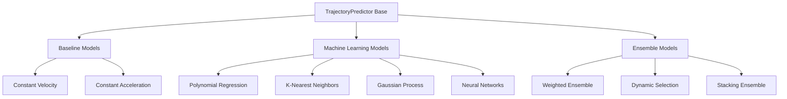
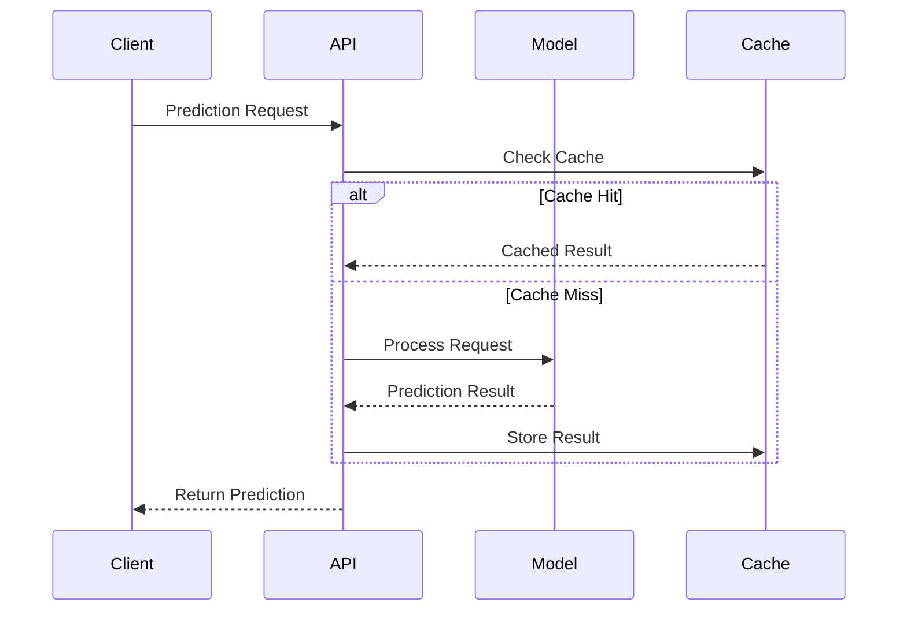
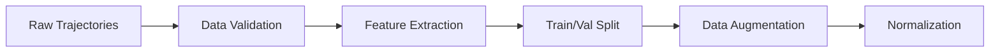

# Model Architecture Overview

The Trajectory Prediction System employs a modular architecture that supports multiple prediction models, from physics-based baselines to advanced machine learning approaches.

## Architecture Principles

### 1. **Modular Design**
- Each model implements a common interface (`TrajectoryPredictor`)
- Plug-and-play architecture for easy model integration
- Standardized input/output formats across all models

### 2. **Physics-Informed Approach**
- Integration of physical constraints and domain knowledge
- Uncertainty quantification for all predictions
- Realistic motion modeling with kinematic validation

### 3. **Scalable Inference**
- Asynchronous prediction pipelines
- Batch processing capabilities
- Caching and optimization for production use

## Model Hierarchy



## Base Architecture Components

### TrajectoryPredictor Interface

All models inherit from the base `TrajectoryPredictor` class:

```python
class TrajectoryPredictor(ABC):
    """Abstract base class for trajectory prediction models."""
    
    def __init__(self):
        self.model_name: str = "base_predictor"
        self.is_trained: bool = False
        self.config: Dict[str, Any] = {}
        self.feature_extractor: Optional[FeatureExtractor] = None
    
    @abstractmethod
    async def predict(
        self, 
        trajectory: TrajectoryData, 
        prediction_horizon: float = 5.0,
        time_step: float = 0.1,
        **kwargs
    ) -> TrajectoryData:
        """Predict future trajectory points."""
        pass
    
    @abstractmethod
    async def train(
        self,
        trajectories: List[TrajectoryData],
        validation_data: Optional[List[TrajectoryData]] = None,
        **kwargs
    ) -> Dict[str, Any]:
        """Train the model on trajectory data."""
        pass
    
    @abstractmethod
    async def evaluate(
        self,
        trajectories: List[TrajectoryData],
        ground_truth: List[TrajectoryData],
        **kwargs
    ) -> Dict[str, float]:
        """Evaluate model performance."""
        pass
```

### Key Architectural Features

#### 1. **Asynchronous Processing**
All model operations are asynchronous to support:
- Non-blocking prediction requests
- Concurrent batch processing
- Integration with async web frameworks

#### 2. **Standardized Data Flow**


#### 3. **Feature Engineering Pipeline**
```python
class FeatureExtractor:
    def extract_features(self, trajectory: TrajectoryData) -> Dict[str, np.ndarray]:
        """Extract features for model input."""
        return {
            'temporal': self.extract_temporal_features(trajectory),
            'spatial': self.extract_spatial_features(trajectory),
            'kinematic': self.extract_kinematic_features(trajectory),
            'contextual': self.extract_contextual_features(trajectory)
        }
```

## Model Categories

### 1. Baseline Models

#### Constant Velocity Predictor
- **Principle**: Assumes constant velocity motion
- **Strengths**: Fast, interpretable, works well for straight-line motion
- **Use Cases**: Highway scenarios, initial baselines

```python
# Physics equation: x(t) = x₀ + v₀ * t
future_position = current_position + velocity * time_delta
```

#### Constant Acceleration Predictor  
- **Principle**: Assumes constant acceleration motion
- **Strengths**: Handles acceleration/deceleration scenarios
- **Use Cases**: Traffic scenarios, lane changes

```python
# Physics equation: x(t) = x₀ + v₀*t + 0.5*a*t²
future_position = current_position + velocity * time_delta + 0.5 * acceleration * time_delta**2
```

### 2. Machine Learning Models

#### Polynomial Trajectory Predictor
- **Principle**: Fits polynomial curves to trajectory data
- **Features**: Bayesian regularization, physics constraints
- **Complexity**: O(n³) for degree-n polynomials

```python
# Polynomial fitting with physics constraints
coefficients = np.polyfit(timestamps, positions, degree=3)
future_trajectory = np.polyval(coefficients, future_timestamps)
```

#### K-Nearest Neighbors Predictor
- **Principle**: Finds similar historical trajectories
- **Features**: Dynamic Time Warping similarity, ensemble prediction
- **Strengths**: Non-parametric, handles complex patterns

```python
# DTW-based similarity matching
similarities = [dtw_distance(query, candidate) for candidate in training_set]
k_nearest = select_k_nearest(similarities, k=5)
prediction = ensemble_predict(k_nearest)
```

#### Gaussian Process Predictor
- **Principle**: Probabilistic regression with uncertainty quantification
- **Features**: Non-linear kernels, confidence intervals
- **Strengths**: Principled uncertainty, smooth predictions

```python
# GP prediction with RBF kernel
gp = GaussianProcess(kernel=RBF(length_scale=1.0))
mean_prediction, uncertainty = gp.predict(future_times)
```

### 3. Advanced Models (Future Extensions)

#### Long Short-Term Memory (LSTM)
- **Architecture**: Recurrent neural network for sequence modeling
- **Features**: Attention mechanisms, multi-modal inputs
- **Strengths**: Captures long-term dependencies

#### Transformer-Based Models
- **Architecture**: Self-attention for sequence-to-sequence prediction
- **Features**: Multi-head attention, positional encoding
- **Strengths**: Parallel processing, long-range dependencies

#### Graph Neural Networks
- **Architecture**: Models vehicle interactions as graphs
- **Features**: Social pooling, attention over neighbors
- **Strengths**: Multi-agent scenarios, interaction modeling

## Uncertainty Quantification

All models provide uncertainty estimates through different mechanisms:

### 1. **Parametric Uncertainty**
- Model parameter confidence intervals
- Bootstrap sampling for ensemble uncertainty

### 2. **Epistemic Uncertainty**
- Model uncertainty about the true function
- Bayesian neural networks, Gaussian processes

### 3. **Aleatoric Uncertainty**  
- Inherent noise in observations
- Learned uncertainty through neural network outputs

```python
class UncertaintyQuantification:
    def quantify_uncertainty(
        self,
        predictions: np.ndarray,
        model_confidence: float
    ) -> Dict[str, float]:
        return {
            'epistemic': self.calculate_epistemic_uncertainty(predictions),
            'aleatoric': self.calculate_aleatoric_uncertainty(predictions),
            'total': self.calculate_total_uncertainty(predictions),
            'confidence_interval': self.calculate_confidence_interval(predictions)
        }
```

## Model Training Pipeline

### 1. **Data Preparation**


### 2. **Training Process**
```python
async def train_model(
    model: TrajectoryPredictor,
    training_data: List[TrajectoryData],
    validation_data: List[TrajectoryData],
    config: TrainingConfig
) -> TrainingResult:
    
    # Data preprocessing
    train_features = extract_features(training_data)
    val_features = extract_features(validation_data)
    
    # Model training
    training_history = await model.train(
        train_features,
        validation_data=val_features,
        epochs=config.epochs,
        batch_size=config.batch_size
    )
    
    # Model evaluation
    evaluation_results = await model.evaluate(validation_data)
    
    return TrainingResult(
        model=model,
        history=training_history,
        validation_metrics=evaluation_results
    )
```

### 3. **Hyperparameter Optimization**
```python
class HyperparameterOptimizer:
    def __init__(self, optimization_method='bayesian'):
        self.method = optimization_method
        self.search_space = self.define_search_space()
    
    async def optimize(
        self,
        model_class: type,
        training_data: List[TrajectoryData],
        n_trials: int = 100
    ) -> Dict[str, Any]:
        
        best_params = None
        best_score = float('inf')
        
        for trial in range(n_trials):
            # Sample hyperparameters
            params = self.sample_hyperparameters()
            
            # Train model with current params
            model = model_class(**params)
            results = await train_model(model, training_data)
            
            # Update best parameters
            if results.validation_metrics['rmse'] < best_score:
                best_score = results.validation_metrics['rmse']
                best_params = params
        
        return {
            'best_params': best_params,
            'best_score': best_score,
            'optimization_history': self.history
        }
```

## Model Evaluation Framework

### 1. **Evaluation Metrics**

#### Trajectory Metrics
- **RMSE**: Root Mean Square Error
- **MAE**: Mean Absolute Error  
- **ADE**: Average Displacement Error
- **FDE**: Final Displacement Error

#### Safety Metrics
- **TTC**: Time to Collision
- **Minimum Distance**: Closest approach distance
- **Lateral Error**: Cross-track deviation

#### Probabilistic Metrics
- **NLL**: Negative Log-Likelihood
- **Calibration Error**: Prediction confidence calibration
- **Uncertainty Quality**: Correlation between uncertainty and error

### 2. **Cross-Validation Strategy**

```python
class TimeSeriesValidator:
    def __init__(self, n_splits=5, test_size=0.2):
        self.n_splits = n_splits
        self.test_size = test_size
    
    def split(self, trajectories: List[TrajectoryData]) -> Iterator[Tuple[List, List]]:
        """Time-aware cross-validation splits."""
        # Sort by timestamp to maintain temporal order
        sorted_trajectories = sorted(trajectories, key=lambda x: x.timestamps[0])
        
        for i in range(self.n_splits):
            # Calculate split indices
            train_end = int(len(sorted_trajectories) * (1 - self.test_size))
            test_start = train_end
            
            train_data = sorted_trajectories[:train_end]
            test_data = sorted_trajectories[test_start:]
            
            yield train_data, test_data
```

## Model Serving Architecture

### 1. **Model Loading and Caching**
```python
class ModelManager:
    def __init__(self):
        self.loaded_models: Dict[str, TrajectoryPredictor] = {}
        self.model_cache = LRUCache(maxsize=10)
        
    async def load_model(self, model_name: str) -> TrajectoryPredictor:
        """Load and cache model for serving."""
        if model_name not in self.loaded_models:
            model = await self._load_model_from_storage(model_name)
            self.loaded_models[model_name] = model
        
        return self.loaded_models[model_name]
    
    async def predict(
        self,
        model_name: str,
        trajectory: TrajectoryData,
        **kwargs
    ) -> TrajectoryData:
        """Serve prediction with caching."""
        cache_key = self._generate_cache_key(model_name, trajectory, kwargs)
        
        if cache_key in self.model_cache:
            return self.model_cache[cache_key]
        
        model = await self.load_model(model_name)
        prediction = await model.predict(trajectory, **kwargs)
        
        self.model_cache[cache_key] = prediction
        return prediction
```

### 2. **Batch Processing Optimization**
```python
class BatchProcessor:
    def __init__(self, batch_size: int = 32, timeout: float = 1.0):
        self.batch_size = batch_size
        self.timeout = timeout
        self.pending_requests = []
    
    async def process_request(
        self,
        model: TrajectoryPredictor,
        trajectory: TrajectoryData,
        **kwargs
    ) -> TrajectoryData:
        """Process individual request with batching."""
        request = PredictionRequest(trajectory, kwargs)
        self.pending_requests.append(request)
        
        # Process batch when full or timeout reached
        if len(self.pending_requests) >= self.batch_size:
            return await self._process_batch(model)
        else:
            # Wait for more requests or timeout
            await asyncio.sleep(self.timeout)
            return await self._process_batch(model)
```

## Performance Optimization

### 1. **Memory Management**
- Efficient data structures (NumPy arrays)
- Memory pooling for frequent allocations
- Garbage collection optimization

### 2. **Computational Optimization**
- Vectorized operations with NumPy/Numba
- Parallel processing for independent predictions
- GPU acceleration for neural networks (future)

### 3. **Caching Strategy**
- Multi-level caching (memory + Redis)
- Smart cache invalidation
- Prediction result caching

## Extensibility

### Adding New Models

1. **Inherit from Base Class**
```python
class CustomPredictor(TrajectoryPredictor):
    def __init__(self, custom_param: float):
        super().__init__()
        self.model_name = "custom_predictor"
        self.custom_param = custom_param
```

2. **Implement Required Methods**
```python
async def predict(self, trajectory: TrajectoryData, **kwargs) -> TrajectoryData:
    # Custom prediction logic
    pass

async def train(self, trajectories: List[TrajectoryData], **kwargs) -> Dict[str, Any]:
    # Custom training logic
    pass
```

3. **Register with Model Factory**
```python
ModelFactory.register("custom_predictor", CustomPredictor)
```

### Integration Points
- **Feature Extractors**: Custom feature engineering
- **Uncertainty Quantification**: Alternative uncertainty methods
- **Evaluation Metrics**: Domain-specific metrics
- **Visualization**: Custom plotting and analysis tools

This modular architecture ensures that the trajectory prediction system can evolve with new research developments while maintaining backward compatibility and production stability.